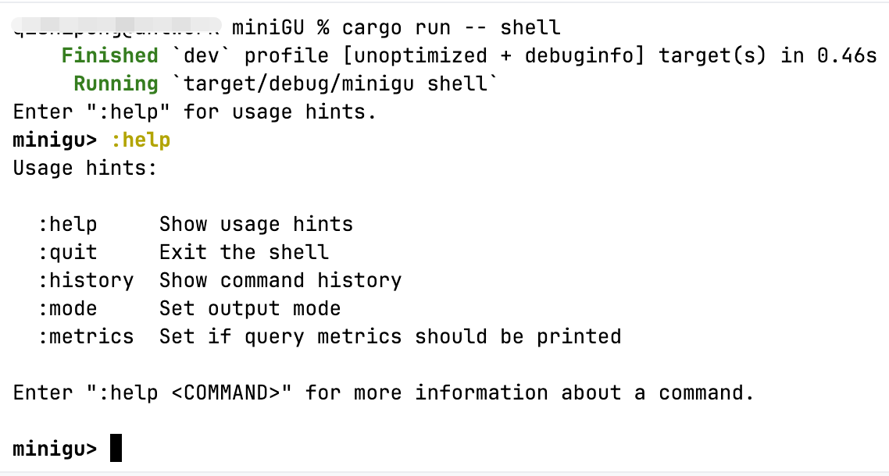

# 快速上手
## 兼容性
作为嵌入式的图数据库，MiniGU尽可能的兼容支持不同CPU架构平台，当前支持编译运行的平台包括

+ x86系列芯片
+ Apple M系列芯片，如Apple M4 Pro

操作系统包括：

+ Ubuntu
+ Windows
+ MacOS

## 开发环境搭建
### 安装Rust和Cargo环境
Cargo是Rust语言的现代工具链，它可以像Maven、Pip等工具一样帮助你瞎子啊、编译、管理依赖，并帮助你发布项目等。

Cargo的使用可以参考：[https://doc.rust-lang.org/stable/cargo/getting-started/installation.html](https://doc.rust-lang.org/stable/cargo/getting-started/installation.html)

当你正确安装了Cargo之后，在Shell中执行`cargo version`命令，可以看到如下输出

```shell
xxxxx@xxxxxx miniGU % cargo version
cargo 1.86.0-nightly (088d49608 2025-01-10)
```

### 配置IDE集成开发环境
这里推荐`RustRover`和`VS Code`两种IDE进行后续的学习和开发工作

#### 基于RustRover进行开发
> [https://www.jetbrains.com/rust/](https://www.jetbrains.com/rust/)
>

`RustRover`是由`Jetbrains`公司开发一款支持Rust开发、调试的强大的IDE

#### 基于VS Code进行开发
> [https://code.visualstudio.com/](https://code.visualstudio.com/)
>

VS Code是Microsoft公司开源的一款强大的、扩展性极强的IDE，可以安装各类插件来定制你的开发环境。

#### 其他开发环境
AI时代，我们也推荐其他开发环境来上手学习，如Cursor等热门大模型赋能的IDE。但需要提醒的是，我们在使用编程助手的时候，不仅要关注如何与编程助手交互，更重要的是搞清楚编程助手辅助下写出来的代码，这样才会有所收获。


## 编译与运行
> 前提：已经正确安装部署了Git、Rust和Cargo环境
>

```shell
# 克隆项目地址
git clone https://github.com/TuGraph-family/miniGU.git
# 使用cargo构建项目
cargo build
# 使用cargo运行测试用例
cargo test
```

项目正确构建，你将会看到如下输出


运行测试时，你应该看到类似输出：

```shell
.........
running 0 tests
test result: ok. 0 passed; 0 failed; 0 ignored; 0 measured; 0 filtered out; finished in 0.00s
   Doc-tests minigu_transaction
running 0 tests
test result: ok. 0 passed; 0 failed; 0 ignored; 0 measured; 0 filtered out; finished in 0.00s
   Doc-tests vector
running 0 tests
test result: ok. 0 passed; 0 failed; 0 ignored; 0 measured; 0 filtered out; finished in 0.00s
```

同时，MiniGU项目还支持交互式命令行模式的运行，参考命令如下

```markdown
cargo run -- shell    # start in debug mode
cargo run -r -- shell # start in release mode
```

交互式命令模式下运行，你将看到如下输出：

